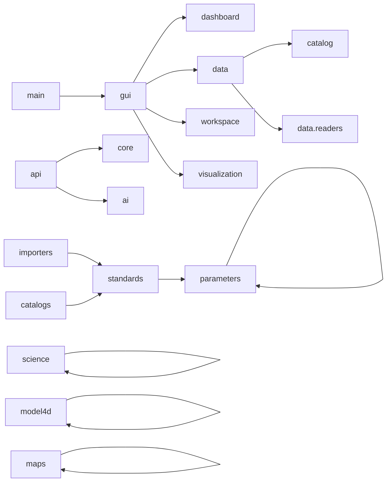

<!-- ACF_OUTDATED_SNAPSHOT_BANNER_2026-09-02 -->
> **📅 Outdated snapshot.** This is a real, dated analysis of the repository
> as it stood when written — not a false completion claim — but the specific
> numbers below (module/file/dependency counts) are now superseded: this
> session alone took the source tree from ~563 to 1353+ production modules,
> removed several of the dependencies listed below as genuinely unused
> (`pandas`, `shapely`, `rasterio`, `h5py`), and resolved some of the
> duplications this file documents. See
> [`../../ROADMAP.md`](../../ROADMAP.md) and
> [`../ACF_PHYSICS_GUARD_AUDIT_CHANGELOG.md`](../ACF_PHYSICS_GUARD_AUDIT_CHANGELOG.md)
> for the current, reproducible state. Re-running this analysis fresh would
> be the correct way to refresh it, not editing the numbers below by hand.
>
> _Banner added 2026-09-02 during a hygiene cleanup pass — original content
> preserved unchanged below._

---

# Graphe des dépendances ACF

## Méthode

L'analyse parcourt les imports `import` et `from ... import ...` des 563 modules de `src/acf`. Les imports dynamiques (`importlib`, `pkgutil`) sont décrits séparément. Un graphe statique ne permet pas de prouver qu'un chemin est exécuté, mais révèle les couplages déclarés et les cycles d'import potentiels.

## Dépendances externes

| Catégorie | Dépendances détectées |
| --- | --- |
| Interface | `PySide6` |
| Calcul et données | `numpy`, `scipy`, `pandas`, `xarray`, `netCDF4`, `h5py` |
| Formats météo | `cfgrib`, `eccodes` |
| Cartographie | `matplotlib`, `cartopy`, `pyproj`, `shapely`, `rasterio` |
| Configuration/log | `yaml` (PyYAML), `loguru` |
| Standard library | `dataclasses`, `pathlib`, `typing`, `datetime`, `math`, `json`, `uuid`, etc. |

`yaml` et `loguru` sont importés par le code mais absents des dépendances déclarées dans `pyproject.toml` et `requirements.txt` : c'est une incohérence de packaging à corriger.

## Graphe entre domaines



Les dépendances inter-domaines explicites restent limitées. Cela reflète autant une modularité que l'existence de systèmes parallèles peu intégrés : par exemple `maps`, `visualization` et `gui.map` se croisent peu malgré des responsabilités similaires.

## Dépendances structurantes

| Consommateur | Dépendances principales | Observation |
| --- | --- | --- |
| `gui.app` | `gui.main_window`, `gui.splash`, `gui.theme` | Chemin de démarrage réel. |
| `gui.main_window` | dashboard, données, workspace, visualisation, GUI map | Composition GUI historique. |
| `api.api` | core default parameters, analyseur, prévision, alertes IA | Façade Python la plus claire. |
| `data.manager` | factory, catalog registry, catalog manager | Dépend du système `catalog`, pas de `catalogs`. |
| `catalogs.hub` | CF/ECMWF catalogs, standards | Système de catalogues parallèle. |
| `standards.hub` | standards manager, ECMWF manager | Pont vers paramètres ECMWF. |
| `science.engine` | thermodynamique, dynamique, météo sévère | Agrégateur scientifique local. |
| `model4d.operators.operators_engine` | gradient, divergence, laplacien, curl, advection, diffusion | Agrégateur d'opérateurs. |
| `data.factory` | découverte dynamique de `data.readers` | Enregistre les lecteurs instanciables. |

## Dépendances dynamiques

`acf.data.factory.ReaderFactory` parcourt `acf.data.readers` avec `pkgutil`, importe les sous-modules avec `importlib`, puis instancie les classes dont le nom se termine par `Reader`. Les erreurs d'instanciation sont ignorées silencieusement.

`acf.core.plugin_manager.PluginManager` parcourt le dossier `plugins`, mais ne charge pas de module ni manifeste. Il n'existe donc pas encore de dépendance de plugin exécutable.

## Cycles détectés

Un seul cycle statique a été détecté :

```text
acf.parameters.aliases → acf.parameters.aliases
```

Il provient d'un auto-import et d'une redéfinition dans `parameters/aliases.py`, également signalés par Ruff. Aucun cycle entre deux modules distincts n'a été détecté par l'analyse AST.

Limites : les imports conditionnels, imports par chaîne et futurs plugins peuvent introduire des cycles à l'exécution. Les tests d'import de package et une CI doivent compléter ce contrôle statique.

## Risques de dépendance

1. `core` n'est pas sur le chemin GUI : les services configurés par bootstrap ne sont pas garantis.
2. Les trois piles de rendu augmentent le risque de dépendances divergentes.
3. `data`, `io` et `importers` se recouvrent sans interface commune.
4. `catalog` et `catalogs` utilisent des modèles de catalogue séparés.
5. Le chargement dynamique de lecteurs masque les erreurs de construction.

## Recommandations

- Faire de `Bootstrap` la composition root de l'application.
- Introduire des interfaces de lecteur, catalogue, couche et renderer canoniques.
- Rendre les erreurs de découverte visibles et testables.
- Ajouter un contrôle de cycles d'import à la CI.
- Définir les dépendances optionnelles pour GPU, MPI et Dask au lieu de les importer implicitement.
