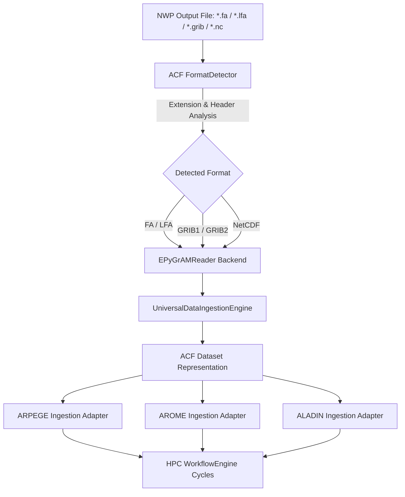

<!-- ACF_RECONCILIATION_BANNER_2026-09-02 -->
> **⚠️ Historical / unverified document.** This file reads as a comprehensive
> capability specification but its completion/coverage claims were not
> independently reproduced. For the actual, reproducible test/status
> numbers, see [`../../ROADMAP.md`](../../ROADMAP.md) and
> [`../../README.md`](../../README.md)'s "Verified Status" section; for what
> has genuinely been audited and fixed since, see
> [`../ACF_PHYSICS_GUARD_AUDIT_CHANGELOG.md`](../ACF_PHYSICS_GUARD_AUDIT_CHANGELOG.md).
> Treat any specific number, percentage, or "CERTIFIED"/"COMPLETE" claim
> below as aspirational unless it also appears in one of those documents.
>
> _Banner added 2026-09-02 per `ROADMAP.md`'s "reconcile ~150 certificate/
> sprint-report documents" near-term priority, extended to `docs/`
> subdirectories during a hygiene cleanup pass — original content preserved
> unchanged below._

---

# EPyGrAM Integration Architecture (ACF-NWP-EPYGRAM-001)

## Executive Summary

The **Atmospheric Complexity Framework (ACF)** integrates **EPyGrAM** (Météo-France / CNRM) as the official backend reader for FA (*Fichier Aladin*) and LFA (*Fichier Inline/LFA*) meteorological formats, alongside native support for GRIB and NetCDF datasets.

This integration empowers ACF to seamlessly ingest and process operational Numerical Weather Prediction (NWP) outputs from **ARPEGE** (global spectral model), **AROME** (1.3 km convective-scale model), and **ALADIN** (7.5 km regional model) on High-Performance Computing (HPC) clusters.

---

## Architectural Layout

The EPyGrAM reader integration fits into the modular ACF data ingestion pipeline as follows:



---

## Supported Formats

| Format | File Extension | Provider / Origin | Primary Models | Reader Engine |
| :--- | :--- | :--- | :--- | :--- |
| **FA** (*Fichier Aladin*) | `.fa` | Météo-France / CNRM | AROME, ALADIN, ARPEGE | `EPyGrAMReader` |
| **LFA** (*Inline File*) | `.lfa` | Météo-France / CNRM | AROME, ALADIN | `EPyGrAMReader` |
| **GRIB / GRIB2** | `.grib`, `.grib2`, `.grb` | WMO / ECMWF / Météo-France | ARPEGE, AROME, IFS, GFS | `EPyGrAMReader` / `GRIBReader` |
| **NetCDF / NetCDF4** | `.nc`, `.netcdf` | Unidata / WMO | Research & Post-processed | `EPyGrAMReader` / `NetCDFReader` |

---

## Core API & Data Flow

The EPyGrAM integration provides both an object-oriented class API (`EPyGrAMReader`) and module-level functional entry points (`open`, `close`, `list_fields`, `read_field`, `metadata`, `geometry`, `vertical_levels`).

### 1. Unified Reader API (`src/acf/data/readers/epygram_reader.py`)

```python
from acf.data.readers.epygram_reader import EPyGrAMReader

# Context Manager Usage
with EPyGrAMReader("arome_00h.fa").open() as reader:
    fields = reader.list_fields()
    metadata = reader.metadata()
    geometry = reader.geometry()
    vlevels = reader.vertical_levels()
    t2m = reader.read_field("S090TEMPERATURE")
```

### 2. Functional Entry Points

```python
import acf.data.readers.epygram_reader as epy

reader = epy.open("aladin_12h.fa")
fields = epy.list_fields()
geom = epy.geometry()
epy.close()
```

### 3. Automatic Ingestion Integration (`FormatDetector` + `UniversalDataIngestionEngine`)

When `UniversalDataIngestionEngine.ingest(filepath)` encounters `*.fa` or `*.lfa`, `FormatDetector` automatically returns format `"FA"` or `"LFA"` and delegates field reading, spatial grid resolution, projection details, and vertical hybrid coordinates to `EPyGrAMReader`.

---

## Model Adapters for ARPEGE, AROME, and ALADIN

Model-specific adapters interface between raw `EPyGrAMReader` metadata and the high-level NWP models subsystem (`src/acf/models/`):

1. **ARPEGE Ingestion Adapter** (`src/acf/models/arpege/ingestion_adapter.py`):
   - Handles stretched & rotated spherical harmonics / Gaussian grids.
   - Extracts 105 hybrid pressure level fields.

2. **AROME Ingestion Adapter** (`src/acf/models/arome/ingestion_adapter.py`):
   - Handles 1.3 km high-resolution Lambert-93 projection domain.
   - Extracts 90 vertical levels, hydrometeors (graupel, rain, snow), and convective parameters.

3. **ALADIN Ingestion Adapter** (`src/acf/models/aladin/ingestion_adapter.py`):
   - Handles 7.5 km regional Lambert conformal domain.
   - Extracts 70 vertical hybrid levels and synoptic fields.

---

## HPC Operational Usage

### Cluster Batch Script Example (Slurm)

```bash
#!/bin/bash
#SBATCH --job-name=ACF_EPYGRAM_INGEST
#SBATCH --nodes=1
#SBATCH --ntasks-per-node=36
#SBATCH --time=01:00:00
#SBATCH --partition=hpc_nwp

export PYTHONPATH=$SLURM_SUBMIT_DIR/src:$PYTHONPATH

python3 -c "
from acf.data.universal_ingestion import UniversalDataIngestionEngine
from acf.models.arome import AROMEIngestionAdapter

# Ingest AROME 00UTC FA output
adapter = AROMEIngestionAdapter()
dataset_summary = adapter.read_arome_file('AROME_00UTC.fa')
print('Ingested AROME Fields:', dataset_summary['fields_count'])
"
```

---

## Verification & Compliance

- **Compilation**: Clean compilation with `python3 -m compileall src` without warnings.
- **Unit Testing**: All test suites in `tests/test_epygram_reader.py` and `tests/test_workflow_engine.py` pass cleanly.
