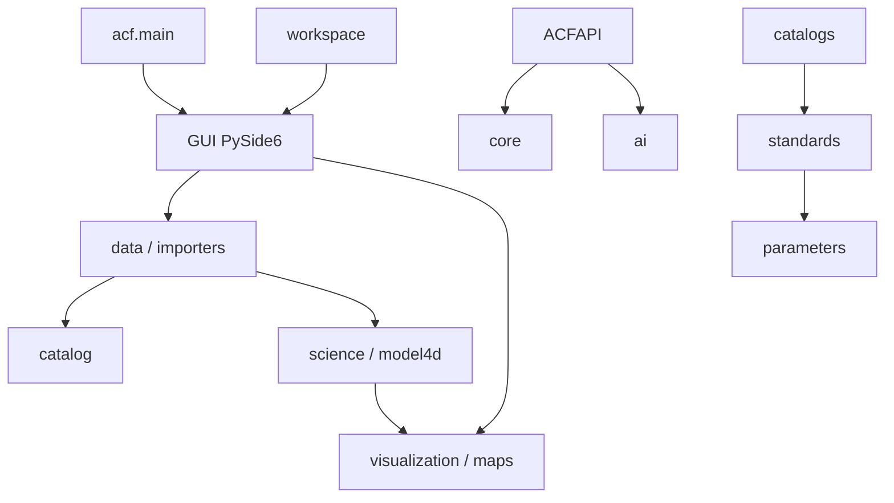

# Cartographie des modules ACF

## Portée et méthode

Cette cartographie décrit l'état du dépôt ACF au moment de l'analyse. Elle couvre les **563 modules Python de production** situés sous `src/acf` (41 640 lignes), ainsi que leurs relations explicites par import. Les 355 autres fichiers Python du dépôt sont des tests, exemples, outils, ou fichiers de racine ; ils ne sont pas comptés comme modules de production.

Un module est qualifié de **public par convention** lorsque son nom ne commence pas par `_`. Cette convention ne garantit pas une API stable : les exports des `__init__.py` sont généralement vides et aucune politique de stabilité n'est encore formalisée.

## Vue logique



## Domaines et responsabilités

| Domaine | Modules | Rôle actuel | État architectural |
| --- | ---: | --- | --- |
| `core` | 15 | Configuration, journalisation, bootstrap, services, plugins. | Socle partiellement déconnecté du démarrage GUI. |
| `gui` | 79 | Application PySide6, fenêtres, docks, widgets, thèmes, carte. | Actif ; deux générations de fenêtre et de cartographie coexistent. |
| `data` | 57 | Dataset, lecteurs, intégration, cache, fusion, validation. | Actif ; recouvre `io` et contient plusieurs lecteurs concurrents. |
| `model4d` | 177 | Structures 4D, interpolation, opérateurs et moteurs physiques. | Très étendu, majoritairement composé de composants isolés. |
| `science` | 44 | Formules thermodynamiques et diagnostics météorologiques. | Cohérent localement ; dépendances internes explicites. |
| `maps` | 32 | Couches, projections, canvas, rendus et export. | Concurrent de `visualization` et `gui.map`. |
| `catalog` | 15 | Catalogue de paramètres et datasets. | Actif ; concurrent de `catalogs`. |
| `catalogs` | 10 | Catalogues CF et ECMWF. | API parallèle de `catalog`. |
| `parameters` | 12 | Paramètres, index, alias, recherche et validation. | Service transversal ; un auto-import erroné est présent. |
| `models` | 16 | Registre, détection et métadonnées de modèles météo. | Partiellement implémenté. |
| `standards` | 13 | CF, ECMWF, WMO, NOAA, GRIB. | Base de normalisation utilisée par `catalogs`. |
| `ai` | 12 | Analyse de datasets, alertes, prévision et plugins IA. | Petite façade fonctionnelle ; pas de registre ML unifié. |
| `workspace` | 8 | Création, sérialisation et projets récents. | Actif, raccordé à une génération de GUI. |
| `importers` | 11 | Import CF, WMO, ECMWF. | Parallèle aux lecteurs `data`. |
| `visualization` | 11 | Couches, rendu, colormaps, gestionnaire de visualisation. | Actif depuis la fenêtre GUI historique. |
| `awci` | 4 | Calcul, pondération et normalisation AWCI. | Sous-système autonome. |
| Autres | 67 | API, animation, dashboard, IO, validation, temps, utilitaires. | Services spécialisés ou squelettes. |

## Fiches des domaines principaux

### Application et noyau

- `acf.main` est le point d'entrée exécutable réel : il appelle `acf.gui.app.run`.
- `acf.gui.app` crée `QApplication`, applique le thème, affiche le splash screen puis `acf.gui.main_window.MainWindow`.
- `acf.core.application.Application` et `acf.core.bootstrap.Bootstrap` prévoient une initialisation de configuration, services et plugins, mais ne sont pas appelés par le chemin GUI.
- `acf.core.config.ConfigManager` charge `config/config.yaml`; `ServiceManager` fournit un registre en mémoire ; `PluginManager` ne découvre actuellement que des noms de dossiers.

### Données, import et standards

`data` héberge le type `Dataset`, les lecteurs et l'intégration de formats. `importers` fournit des importateurs CF/WMO/ECMWF. `standards` et `parameters` portent les référentiels et la recherche de paramètres. `catalog` et `catalogs` représentent deux familles de catalogues non unifiées.

Flux attendu, encore non uniformisé :

```text
format externe → lecteur/importateur → Dataset + métadonnées
→ validation/normalisation → science ou model4d → visualisation/API
```

### Calcul scientifique et modèles

`science` regroupe des diagnostics unitaires (température potentielle, humidité, CAPE, indices, dynamique). `model4d` apporte `Grid4D`, `Field4D`, axes, interpolation, opérateurs, puis 140+ modules de physique et d'aide à la prévision. `models` gère les métadonnées et la détection de modèles, sans exécuteur numérique général.

### Interface et visualisation

Trois familles se superposent :

- `gui.map` : canvas Qt, caméra, scène, navigation, couches et renderers ;
- `maps` : canvas Matplotlib/Cartopy, couches et renderers ;
- `visualization` : couches et rendu abstrait, utilisé par une fenêtre GUI historique.

La fenêtre réellement instanciée par `gui.app` est `acf.gui.main_window.MainWindow` (le module fichier). Une seconde classe `MainWindow` existe dans `acf.gui.main_window.main_window`.

### IA

`ai` expose `DatasetAnalyzer`, `ForecastAssistant`, `WeatherAlertEngine` et un gestionnaire de plugins IA. `ACFAPI` compose ces services. Les moteurs d'aide à la prévision de `model4d.physics` sont des composants distincts ; ils ne sont pas enregistrés par un orchestrateur IA commun.

## Points d'entrée

| Point | Statut | Usage |
| --- | --- | --- |
| `src/acf/main.py` | principal | Démarre la GUI. |
| `acf.gui.app.run()` | principal | Lance Qt et la fenêtre principale. |
| `acf.api.api.ACFAPI` | bibliothèque | Façade Python d'analyse, prévision et alertes. |
| `acf.core.application.Application.start()` | secondaire | Bootstrap console, non relié à la GUI. |
| `tests/gui/test_map_canvas.py` | démonstration/test | Contient un bloc `__main__`. |

Les scripts racine `test_dashboard.py` et `test_awci_display.py` ont aussi un bloc `__main__`, mais ne sont pas dans le périmètre Pytest configuré.

## Frontières cibles à préserver

- La GUI ne doit pas implémenter de calcul scientifique coûteux.
- Les services scientifiques ne doivent pas dépendre de PySide6.
- Les formats externes doivent converger vers un modèle de données et de métadonnées commun.
- Les renderers doivent dépendre de couches abstraites, pas directement des lecteurs.
- Les extensions doivent être chargées depuis des contrats de plugin explicites.

## Composants à statut incertain

Les packages `analysis`, `alerts`, `plugins`, `reports` et plusieurs `__init__.py` sont vides. De nombreux modules de `models.implementations`, writers, panneaux GUI et standards historiques sont également vides. Ils sont présents dans le package mais ne constituent pas une capacité opérationnelle démontrée.
