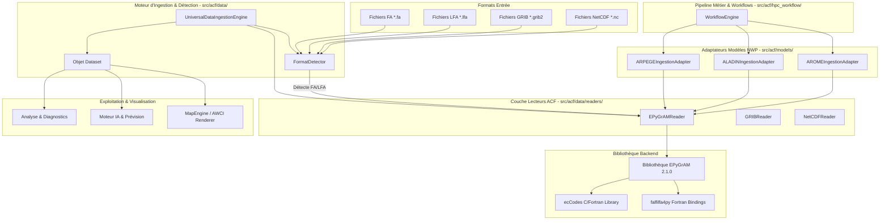
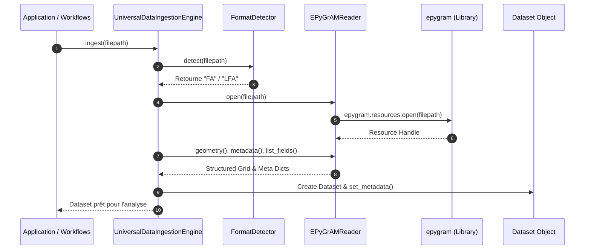

# GRAPHE DE DÉPENDANCES ET D'INTÉGRATION EPYGRAM (ACF-ARCH-EPYGRAM-001)

**Role :** Principal Software Architect & Principal HPC Architect  
**Date :** 3 août 2026  
**Dépôt :** Atmospheric Complexity Framework (ACF)  

---

## 1. Graphe Global des Dépendances Composants

---

## 2. Diagramme de Flux de Données Séquentiel

---

## 3. Matrice de Isolation des Couches (Layer Isolation Rules)

| Couche Subsystem | Accès Direct à `epygram` ? | Interdiction Strict |
| :--- | :--- | :--- |
| `src/acf/data/readers/` | **OUI** (Seul point d'entrée officiel) | Ne doit pas dépendre de la GUI ou des solveurs |
| `src/acf/models/` | **OUI** (Via `EPyGrAMReader`) | Ne doit pas implémenter la logique binaire FA |
| `src/acf/hpc_workflow/` | **NON** (Via les adaptateurs modèles) | Ne doit pas importer directement `epygram` |
| `src/acf/gui/` | **STRICTEMENT NON** | Dépend uniquement des objets `Dataset` ou `MapEngine` |
| `src/acf/simulation_engine/` | **STRICTEMENT NON** | Indépendant des formats de fichiers physiques |
