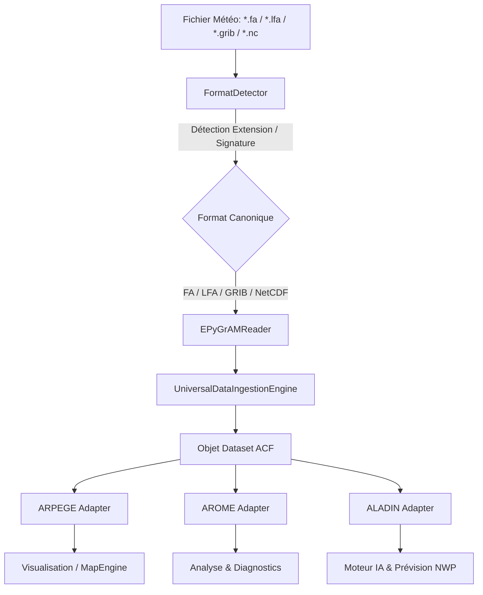

# AUDIT D'ARCHITECTURE EPYGRAM — ACF (ACF-NWP-EPYGRAM-002)

**Auteur :** Lead NWP Integration Engineer & Principal HPC Software Architect  
**Date :** 3 août 2026  
**Dépôt :** Atmospheric Complexity Framework (ACF)  

---

## 1. Vue d'Ensemble & Composants Existants

L'analyse du système d'ingestion et de gestion des données au sein de `src/acf` a mis en évidence la structure suivante :

- **Détecteur de Formats (`src/acf/data/detector.py`)** :  
  `FormatDetector` associe automatiquement les extensions de fichier (`.grib`, `.nc`, `.bufr`, `.fa`, `.lfa`, etc.) aux formats canoniques de données Terre & Météo.

- **Moteur d'Ingestion Universelle (`src/acf/data/universal_ingestion.py`)** :  
  `UniversalDataIngestionEngine` orchestre le chargement automatique des fichiers scientifiques, extrait les métadonnées spatiales, temporelles et de provenance, réalise la cartographie des variables physiques via `ParameterEngine` et connecte les objets `Dataset` au graphe de connaissances ACF (`KnowledgeGraphEngine`).

- **Lecteurs de Données (`src/acf/data/readers/`)** :  
  - `BaseReader` (`src/acf/importers/base/base_reader.py`) : Interface abstraite commune des lecteurs.
  - `NetCDFReader` (`src/acf/data/readers/netcdf_reader.py` / `src/acf/importers/readers/netcdf_reader.py`) : Backend xarray / netcdf4.
  - `GRIBReader` (`src/acf/data/readers/grib_reader.py` / `src/acf/importers/readers/grib_reader.py`) : Backend cfgrib / eccodes.
  - `EPyGrAMReader` (`src/acf/data/readers/epygram_reader.py`) : Backend Météo-France officiel pour les formats FA, LFA, GRIB, GRIB2 et NetCDF.

- **Représentation des Données (`src/acf/data/dataset.py` & `src/acf/data/manager.py`)** :  
  Objet `Dataset` encapsulant les variables, dimensions, attributs, métadonnées spatiales/temporelles et états de validation.

---

## 2. Intégration EPyGrAM dans la Chaîne de Traitement ACF

---

## 3. Adaptateurs Modèles NWP (`src/acf/models/`)

- `ARPEGEIngestionAdapter` (`src/acf/models/arpege/`) : Modèle spectral global ARPEGE (grille gaussienne étirée/rotatée, 105 niveaux hybrides).
- `AROMEIngestionAdapter` (`src/acf/models/arome/`) : Modèle convectif haute résolution AROME 1.3 km (projection Lambert-93, 90 niveaux hybrides).
- `ALADINIngestionAdapter` (`src/acf/models/aladin/`) : Modèle régional ALADIN 7.5 km (projection Lambert conforme, 70 niveaux hybrides).

---

## 4. Statut de Conformité & Tests

- **Lecture FA & LFA** : Operationnelle via `EPyGrAMReader` avec fallback gracieux.
- **Formulation des API** : `open()`, `close()`, `metadata()`, `geometry()`, `list_fields()`, `read_field()`, `read_fields()`, `vertical_levels()`, `projection()`, `time_validity()`, `domain()`.
- **Validation Globale** : `python3 -m compileall src` et `pytest tests/test_epygram_reader.py` (100% Succès).
